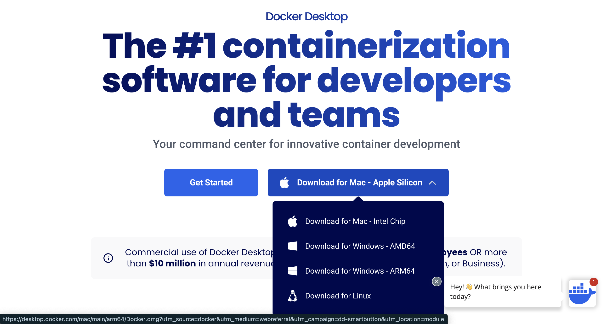
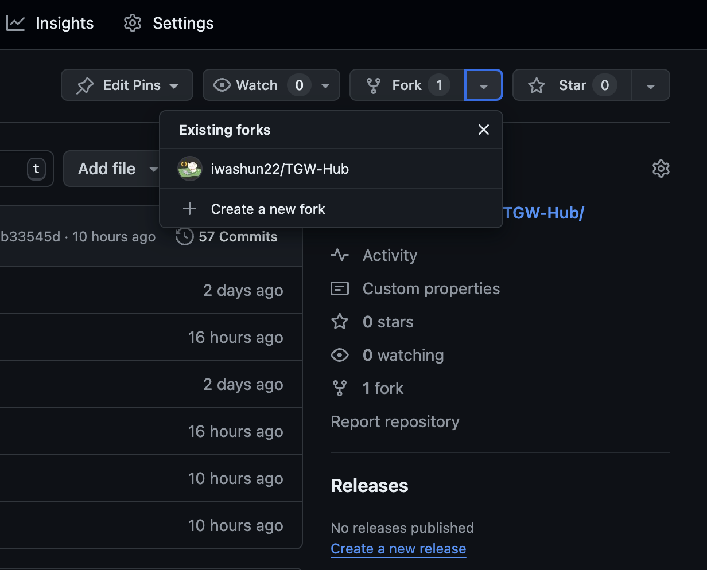
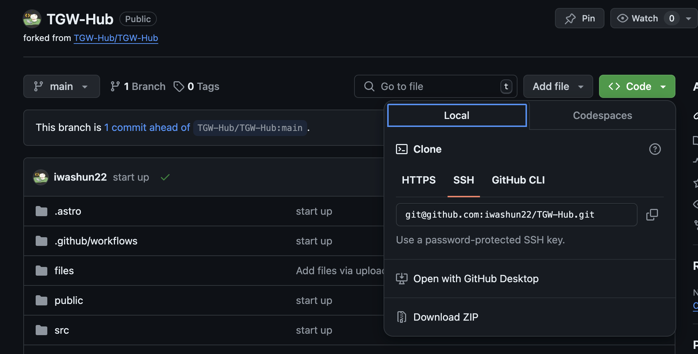

# プロジェクトの進め方

## 始めに・・・

> このプロジェクト含め、これから先使うたくさんのライブラリのダウンロードを避けれるため、おすすめのツールです。　もちろん使わなくても大丈夫ですが、その場合だと機内にライブラリをインストールする必要があります。

まずは [Docker](https://docker.com.products/docker-desktop) をインストールしてください。
お使いのCPUのプロセッサを選択してください。



コマンドライン（CLI）で使用できるように設定をしてください。

## プロジェクトに取り組む

Githubにあるリポジトリに直接触れないでください。まずはフォークをして、自分のプロジェクトとして管理します。



その後に自分のレポジトリをクローンします。



- 何か変更したい場合は必ず自分のリポジトリにプッシュしてください。
- それからプルリクエストを作ってください。

<video width="500px" controls muted>
  <source src="./manual-images/pull-request.mov">
</video>

## 環境設定

先ほどインストールしたDockerを立ち上げます。ターミナルでプロジェクトのフォルダーに移動してください。
```sh
  cd my/path/TGW-Hub
```

Dockerコンテナを作り、コンテナ内に入って環境を設定します。
```sh
# Docker コンテナを立ち上げる　（仮想マシン）
docker-compose up -d
# Docker コンテナの中に入る
docker-compose exec app bash
# 必要のパッケージをインストール　（機械に保存されません）
yarn install
```

Dockerをインストールしていない場合はそのままパッケージをインストールしてください。
```sh
yarn install
```

コマンドが見つからない場合はNode JSがまだ入っていないので、インストールしてください。
完了したら先ほどのコマンドをもう一回打ってください。
```bash
# nvm　のインストール (Node Version Manager)
curl -o- https://raw.githubusercontent.com/nvm-sh/nvm/v0.40.0/install.sh | bash
# Node.js　のインストール (ターミナルを再起動する必要があるかもしれません)
nvm install 20
```

## 開発する

Astro のライブラリを使ってローカルのWebsiteを立ち上げます。
```sh
yarn dev
```

無事サーバーが立ち上げったら `http://localhost:4321/TGW-Hub` でローカルで見れます。

> ページが `/` からではなく、`/TGW-Hub` なのは [astro.config.mjs](./astro.config.mjs) で指定されている `base` がそれであるためです。開発環境とデプロイする時の環境を一緒にした方が作業が楽になります。そのため、開発環境では `http://localhost:4321/` だとページがありません。

## ファイルの場所と配置

開発する段階においてファイルをできるだけ小さくて、分かりやすいところに置くことはとても大切です。後でバグを修正したり、ちょっとしたデザインの変更が楽になります。

開発で扱うディレクトリは以下の通りです。その他は設定などであまり気にする必要がありません。

- public
- src
  - components
  - images
  - layouts
  - pages

基本的に扱うディレクトリはこれだけです。一つ一つの役割を説明します。

### public

この中のファイルはすべて静的ファイルです。デプロイする際にこの中にあるファイルは全てそのままの形式でコピーされ、使用されます。そのため、このフォルダから使う頻度が多ければ多いほどコンテンツのロードに負担がかかります。　ビデオやフォントなどを収納するのが理想です。
アクセスするために指定するパスは `/TGW-Hub/フォルダー名/ファイル名` になります。

### src

主なコード、内容は全てこの中にあります。そのため、このディレクトリの中にも更に細かく分けていきます。

#### components

この中には Astro の各要素が含まれます。Astro のファイルの中に `html`, `Javascript` と `css` のコード全てが入ります。外部からインポートすることもできます。
出来るだけ小さな要素に分解して組み立てて行くようなイメージです。
例えば [./src/components/Button.astro](./src/components/Button.astro) を見てください。少しコードが複雑になりましたが、もう他の場所では自分で `<button></button>` のスタイルを１から作る必要がなくなりました。
[./src/pages/test.astro](./src/pages/test.astro) に `Button` を導入しているので確認してみてください。ページURLは[http://localhost:4321/TGW-Hub/test](http://localhost:4321/TGW-Hub/test)から見れます。

#### images

この中には画像のファイルが入ります。画像の形式はなんでも使えます。

#### layouts

HTMLの基本要素のテンプレートを収納するフォルダーです。あまり編集しないですが、他のページを追加する際は度々使用します。

#### pages

新しいURLページを作る Astro ファイルです。指定された名前のファイルがパス名になります。
例えば `pages/events.astro` は `/TGW-Hub/events` のURLでアクセスできます。

## 最後に・・・

編集が終わり、ローカルサーバーを終了させたい場合はターミナル内で `Ctrl + C` を押してください。
Dockerを使っている方はコンテナから出て、マシンを停止させてください。
```sh
# Dockerコンテナから出る
exit
# Dockerを停止
docker-compose down
```

説明は以上となります。グループプロジェクトのために役立つリンクを貼っておきます、確認しておいてください。

- [Githubのフォークした元のリポジトリから更新を受け取る方法](https://stackoverflow.com/questions/3903817/pull-new-updates-from-original-github-repository-into-forked-github-repository)
- [Astro のコードの書き方](https://docs.astro.build/ja/basics/astro-components/)